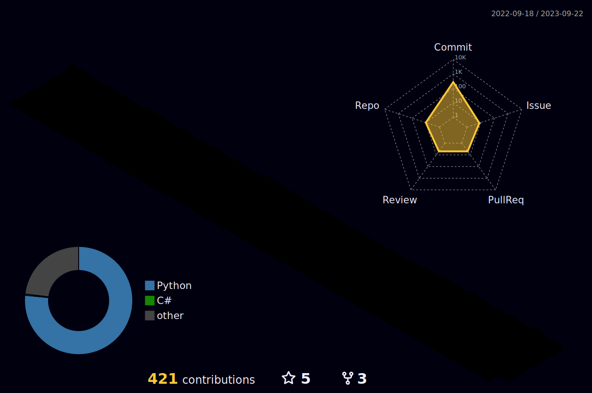
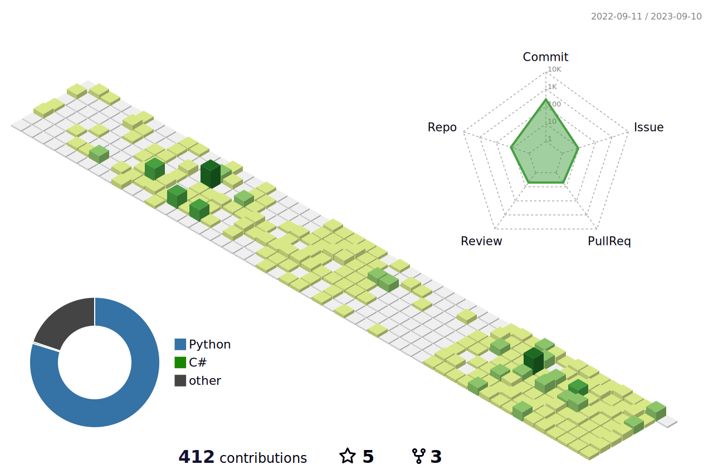

   

 
 

<!-- -->
<!--  -->
<!--  -->

<!--  -->
  
### Who Am I

- 🌱 I’m currently learning `Deep Learning`, `Statistics`, `Linear Algebra`, `Machine Learning`, `Numerical Analysis`
- 🥇 I’m majoring in Artificial Intelligence @SNU

<!--  -->

### Experience

- 💻 UCPC 2023 (Union of Clubs for Programming Contests) ranked 34th place (top 10%) on *final round* (Region: South Korea)
- 📌 Google Developers Machine Learning BC Alumni
- 📺 Korea Electronics Technology Institute (KETI) AI researcher
- 👯 Google Developers MLB 2nd
- 🔫 Ministry of National Defense IT Specialist (Republic of Korea)
- 📝 Python Instructor
- 🌍 Koh young Technology R&D center
- 🔥 Prompt Technology R&D center
- 🎓 Gwacheon Foreign Language High School

### Prize

 - 👑 Seoul Fine Dust Hackathon (Android App, interview loaded on Dong-A Science Magazine 15th)
 - 🏆 Data Creator Camp(Machine Learning, DeepLearning competition)
 - ✨ [Mentoring Project] Best review/postscript Essay Paper Award (invited talk: La Place)
 - 💡 Creative Problem Solving Festival Special Award

### Papers
 - 🚥 Kubernetes-based Framework for Improving Traffic Light Recognition Performance: Convergence Vision AI System based on YOLOv5 and C-RNN with Visual Attention, Hyoung-Seo Cho1, Min-Jung Lee2, Yeon-Jee Han† ACK2022 Accepted
 - 🏥 [ABSTRACT] Skeletal Muscle thresholds for Sarcopenia diagnosis in T12 to L2 vertebra level of Korean Population: Towards the Opportunistic Chest CT Screening, Cho et al, KCR2023, RSNA2023 Accepted
 - :kr: Seoul Historical Site Guide: Bridging Cultures through Conversational AI, LREC-COLLING 2024 submitted

### Patent/Copyright
 - 🚦 YOLOv5, Attention-OCR based Traffic-Light Recognition System (Min-Jung Lee, Hyoung-Seo Cho)

### Publish
 - 📈 (tobe) [High Performance Machine Learning] The Very First Korean JAX/FLAX tutorial

### OpenSource Contribution
 - ☀️[labelCloud](https://github.com/ch-sa/labelCloud)
 - </a> [PyTorchKorea](https://github.com/PyTorchKorea/tutorials-kr)

<!--
### 
- 🚙 2D and 3D (Camera, LiDAR, Radar) calibration on autonomous vehicle
- 🚗 Kubernetes-based Vision AI system to help elderly drivers who are vulnerable to major traffic accidents
- 🔉 barrier-free project: [Seear](http://seear.co.kr) News image captioning for those who are visually impaired
- 🏫 KAIST GSDS

<!--

<!-- # 종류
profile-3d-contrib/profile-green-animate.svg
profile-3d-contrib/profile-green.svg
profile-3d-contrib/profile-season-animate.svg
profile-3d-contrib/profile-season.svg
profile-3d-contrib/profile-south-season-animate.svg
profile-3d-contrib/profile-south-season.svg
profile-3d-contrib/profile-night-view.svg
profile-3d-contrib/profile-night-green.svg
profile-3d-contrib/profile-night-rainbow.svg
profile-3d-contrib/profile-gitblock.svg

 -->

<!-- - -->

<!-- 
- 👯 I’m looking to collaborate on ...
- 🤔 I’m looking for help with ...
- 💬 Ask me about ...

- 😄 Pronouns: ...
 -->
